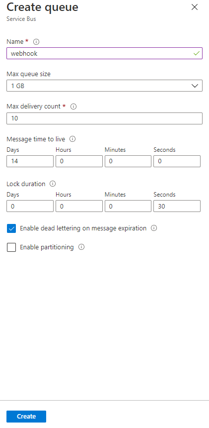
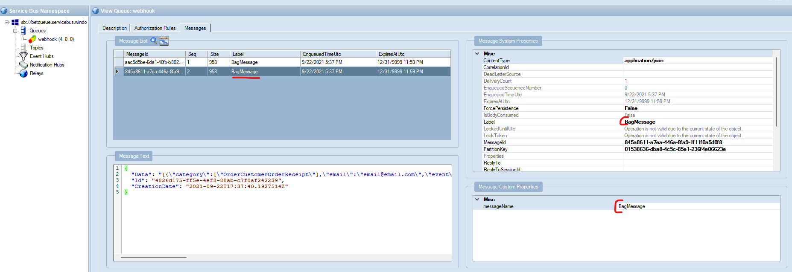
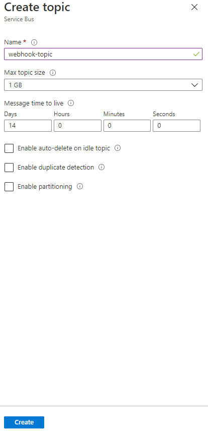
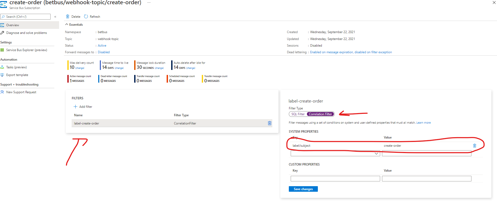
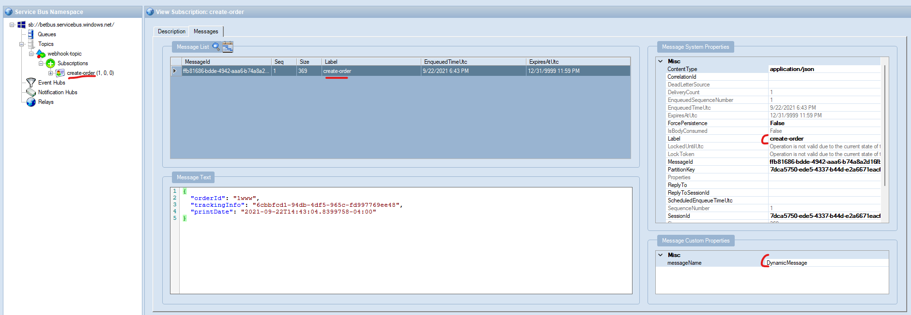

# Bet.Azure.Messaging.Sample


> The second letter in the Hebrew alphabet is the ב bet/beit. Its meaning is "house". In the ancient pictographic Hebrew it was a symbol resembling a tent on a landscape.

The goal of this repo is to provide with a reusable functionality for developing with Azure Cloud.

The libraries are closely integrate with [Azure SDK](https://azure.microsoft.com/en-us/downloads/).

## Hire me

Please send [email](mailto:kingdavidconsulting@gmail.com) if you consider to **hire me**.

[](https://www.buymeacoffee.com/vyve0og)

## Give a Star! :star:

If you like or are using this project to learn or start your solution, please give it a star. Thanks!


This sample console app demonstrates the following:

- Registering Handlers for Queues/Topics with Subscriptions
- Automatically register consumers for processing.
- MSI or ConnectionString Authentication to Azure Service Bus

## Queue

1. Create Queue 

2. Assign Permissions

3. Add a Model and a Handler

```csharp
namespace Bet.Azure.Messaging.Sample.EventHandlers
{
    public class BagMessageHandler : IMessageConsumerHandler<BagMessage>
    {
        private readonly ILogger<BagMessageHandler> _logger;

        public BagMessageHandler(ILogger<BagMessageHandler> logger)
        {
            _logger = logger;
        }

        public Task HandleAsync(BagMessage @event, CancellationToken cancellationToken = default)
        {
            _logger.LogInformation("Message Received");

            _logger.LogInformation(@event.Data);

            return Task.CompletedTask;
        }
    }

    public record BagMessage : EventMessage
    {

        /// <summary>
        /// The data of the paylod.
        /// </summary>
        [JsonInclude]
        public string Data { get; private set; }

        [JsonConstructor]

        public BagMessage(string data)
        {
            Data = data;
        }

    }

    public static class ServiceBusNames
    {
        // namespace for azure service bus
        public const string QueuesOnly = "betqueue";

        public const string TopicSubscriptions = "betbus";
    }
}

```

4. Register with DI

```csharp
        var configuration = hostBuilder.Configuration;

        services.AddAzureServiceBus(
            ServiceBusNames.QueuesOnly,
            builder =>
            {
                var bagOptions = new QueueOptions();
                configuration.Bind($"AzureServiceBus:{ServiceBusNames.QueuesOnly}", bagOptions);

                builder.AddQueue<BagMessage>(bagOptions.Name);
                builder.AddConsumerHandler<BagMessage, BagMessageHandler>(bagOptions.Name);

                // automatically register consumers to be listening to the service bus.
                builder.RegisterConsumers();
            });
```

5. Configure`appsetting.json`

```json
  "AzureServiceBus": {

    "betqueue": {
      "Name": "webhook"
    },

    "betbus": {
      "Name": "webhook-topic",
      "MessageName": "DynamicMessage",
      "SubscriptionName" : "create-order"
    }
  }
```

Custom Message Property `messageName` is used to mark and find handlers here is resulted message in the queue:



## Topic/Subscription

1. Create topic 

2. Create Subscription `create-order` 

3. Create Correlation Filter based on label 

4. Add a Model and a Handler

```csharp
namespace Bet.Azure.Messaging.Sample.EventHandlers
{
    public class DynamicMessageHandler : IDynamicMessageConsumerHandler
    {
        private readonly ILogger<DynamicMessageHandler> _logger;

        public DynamicMessageHandler(ILogger<DynamicMessageHandler> logger)
        {
            _logger = logger ?? throw new System.ArgumentNullException(nameof(logger));
        }

        public Task HandleAsync(dynamic message, CancellationToken cancellationToken = default)
        {
            var json = JsonSerializer.Serialize(message);

            _logger.LogInformation($"Received: {json}");

            if (JsonSerializer.Deserialize<DynamicMessage>(json) is DynamicMessage model)
            {
                _logger.LogInformation(model.OrderId);
            }

            // uncomment this to test error handing routing
            // throw new NotImplementedException();
            return Task.CompletedTask;
        }
    }

    public class DynamicMessage
    {
        [JsonPropertyName("orderId")]
        public string? OrderId { get; set; }

        [JsonPropertyName("trackingInfo")]
        public string? TrackingInfo { get; set; }

        [JsonPropertyName("printDate")]
        public DateTimeOffset? PrintDate { get; set; }
    }
}
```

5. DI Registration

```csharp
    var configuration = hostBuilder.Configuration;

    services.AddAzureServiceBus(
    ServiceBusNames.TopicSubscriptions,
    builder =>
    {
        var dynOptions = new TopicOptions();
        configuration.Bind($"AzureServiceBus:{ServiceBusNames.TopicSubscriptions}", dynOptions);

        builder.AddTopic<DynamicMessage>(dynOptions.Name, dynOptions.SubscriptionName);

        // betbus, webhook-topic, create-order
        builder.AddConsumerHandler<DynamicMessageHandler>(dynOptions.MessageName, dynOptions.Name, dynOptions.SubscriptionName);

        // automatically register consumers to be listening to the service bus.
        builder.RegisterConsumers();
    });
```

Corresponds to the following mapping:


## MSI on local

```bash
    az logout
    az login

    # https://andrewlock.net/how-to-set-the-hosting-environment-in-asp-net-core/
    setx AZURE_TENANT_ID {azure_tenant_id}
```

[JWT decoder](https://jwt.ms/)

## Reference

- [DI Console Template](https://github.com/kdcllc/Bet.Extensions.Templating)
- [Azure Service Bus managed identity in Visual Studio returning 401 - Token issuer is invalid](https://stackoverflow.com/questions/67671421/azure-service-bus-managed-identity-in-visual-studio-returning-401-token-issuer)

- `dotnet tool install --global GitVersion.Tool --version 5.5.1` and `dotnet-gitversion init`
